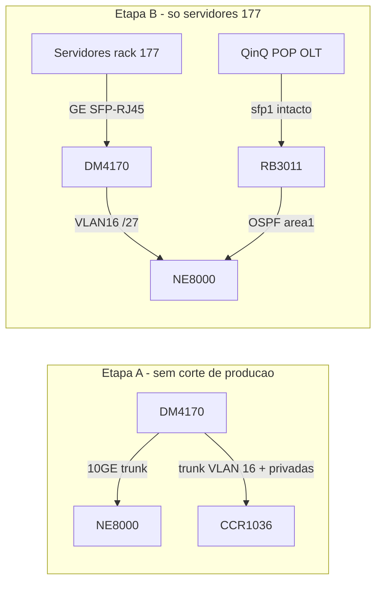

# Plano: Datacom + CCR no NE8000, depois só servidores 177

> Estratégia revisada (2026-07-24): **não misturar** o corte QinQ (POP/OLT) com a migração dos
> servidores locais do bloco `177.72.104.0/27`. Primeiro sobe a infraestrutura nova ligada ao
> NE8000 (Etapa A); depois migrar só os hosts com IP `177.*` do rack (Etapa B). QinQ / `sfp1` /
> descomissionamento do RB3011 ficam para janela futura.
>
> Fontes: [14](14-ips-servidores-e-17772.md), [02](02-arquitetura-alvo.md), [10](10-enderecamento-ccr1036.md),
> decisões #9/#13 em [03](03-decisoes-pendentes.md).

| Continua no RB3011 (nesta fase) | Migra nesta fase |
|---|---|
| `sfp1` QinQ (acesso POP/OLT) | Links novos NE8000↔DM4170↔CCR (Etapa A) |
| OSPF das VLANs POP/OLT | Servidores físicos do rack com 177 (Etapa B) |
| ether/portas só de QinQ | Dono do `/27` → NE8000; NAT → CCR `.4` (Etapa B) |

O enlace atual RB3011↔NE8000 (`192.168.116.32/30` + `177.72.104.52/30`) **permanece** até a
janela QinQ futura — só serve OSPF/POP.

---

## Etapa A — Instalar Datacom + CCR no NE8000 (sem migrar servidor)

**Objetivo:** deixar DM4170 + CCR1036 no rack, cabos e configs L2/L3 de gerenciamento prontos,
**sem** assumir tráfego de produção dos servidores nem tocar no QinQ.

**Não entra:** troca do trunk QinQ, POPs, OLTs, VLANs de acesso, recabeamento de hosts.

**Entra:** 1× 10GE NE8000↔DM4170 + trunk DM4170↔CCR (VLAN 16 + redes privadas);
VLANs de servidor/gerência no DM4170 **sem** hosts plugados; prep da SVI `/27` no NE8000 e do NAT
na CCR (habilitados em bancada, isolados pelo SFP desconectado para não conflitar com o RB3011).

### A.1 Material

| Item | Qtd | Notas |
|---|---|---|
| DM4170 24GX+12XS | 1 | Já no rack / bancada — [02](02-arquitetura-alvo.md) |
| CCR1036 8G-2S+ | 1 | Variante fechada 2026-07-24 |
| Link 10GE NE8000↔DM4170 | 1 | SFP+; porta livre no NE8000 a escolher |
| Trunk DM4170↔CCR | 1 | GE ou 10GE; VLAN 16 (`.4/27`) + VLANs privadas |
| SFP-RJ45 (1000BASE-T) | ~8 | **Só necessário na Etapa B** — pode comprar em paralelo |
| Gerência OOB do DM4170/CCR | — | IP de mgmt fora do `/27` de produção (VLAN/ACL NOC) |

### A.2 Links físicos (só estes)

| # | Link | Velocidade | VLANs nesta etapa | Estado após A |
|---|---|---|---|---|
| 1 | NE8000 ↔ DM4170 | 10GE | VLAN 16 (prep) + VLANs de gerência privada dos clusters (prep) — **sem** QinQ de acesso | UP, sem hosts |
| 2 | DM4170 ↔ CCR1036 | GE/10GE trunk | VLAN 16 + `vlan66`, `vlan116`, `vlan10`, `vlan999`, `vlan109` + VLAN 100 | UP; sem servidores |
| 3 | QinQ `sfp1` RB3011 | — | — | **não mexer** |
| 4 | Servidores → DM4170 | — | — | **Etapa B** |

### A.3 Config — DM4170 (só L2, decisão #13)

Checklist (bancada ou rack, **sem** tráfego de produção):

- [ ] Hostname / NTP / SNMP / ACL de gerência (`IPV4_NOC_NETPAL`)
- [ ] **Nenhuma SVI, nenhum OSPF** no DM4170
- [ ] Criar VLAN 16 (IP Público) — tagged no trunk pro NE8000; **sem** access ports de servidor ainda
- [ ] Criar VLANs de gerência privada do [10](10-enderecamento-ccr1036.md) (`vlan66`, `vlan116`,
      `vlan10`, `vlan999`, `vlan109` + as duas da decisão #12 quando fecharem)
- [ ] Porta 10GE → NE8000: trunk com VLAN 16 + VLANs de gerência acima
- [ ] Porta → CCR: trunk com VLAN 16 pública + VLANs privadas ([10](10-enderecamento-ccr1036.md))
- [ ] Portas GE dos servidores: criar/nomear placeholders (mapa § A.5), deixar `shutdown` ou sem cabo
- [ ] **Não** configurar QinQ termination de acesso nesta etapa (fica pra janela futura)

### A.4 Config — NE8000

- [ ] Porta 10GE nova ↔ DM4170: subinterfaces / trunk L2 para VLAN 16 + gerências (mesmo padrão
      `Gi0/1/8.xxx` dos POPs, IDs a definir na config)
- [ ] **Prep** SVI do `177.72.104.0/27` (gateway alvo = `.1` no NE8000) — **não ativar como
      dono do bloco enquanto o RB3011 ainda tiver `177.72.104.1/27`** (conflito ARP). Opções
      seguras na Etapa A: interface `shutdown`, ou IP temporário de teste fora do `/27`, ou
      validar só L2 (ping entre IPs de gerência dos equipamentos novos)
- [ ] Prep subinterfaces/SVIs das gerências dos clusters (gateways do [10](10-enderecamento-ccr1036.md))
      — idem: sem anunciar se ainda colidem com o RB3011
- [ ] ✅ **NAT fechado (2026-07-27):** CCR **dentro do `/27`** — `177.72.104.4` na VLAN 16
      (via DM4170); GW `.1` no NE8000. Sem rota `/32` / sem ~~`10.254.254.x`~~. Testar ARP/ping
      `.4` na Etapa A antes da B
- [ ] Confirmar que FlowSpec (RR `.27`) e NetStream `:3055` **continuam** pelo caminho atual
      (RB3011) — nenhum next-hop novo nesta etapa

### A.5 Config — CCR1036

- [ ] Trunk ↔ DM4170 com VLAN 16 + VLANs privadas
- [x] SRC-NAT, VLAN 16 `.4` e VLAN 100 `.1` criados e habilitados em bancada; SFP desconectado
- [ ] DST-NAT Dude/TS SIX: decidir `.1` vs `.4` e criar regras
- [ ] OSPF `.4`↔`.1`, ACL roteada e VLAN 15/NTP `.9/30`: desenhados, ainda não aplicados
- [ ] WireGuard: **não configurar agora**; somente pós-migração
- [ ] Automações: **não migrar** (decisão #6)

### A.6 Mapa porta DM4170 (placeholders — Etapa B pluga)

Numeração sugerida nas 24× GE SFP (ajustar no rack). Uplink 10GE usa as XS, não estas.

| Porta GE (placeholder) | Destino (Etapa B) | Meio | VLAN access / tagged |
|---|---|---|---|
| GE1 | RRFlow `177.72.104.27` | SFP-RJ45 | VLAN 16 (pública) |
| GE2 | Proxmox Docker/CDNTV — `eno1` | SFP-RJ45 | native VLAN 100 (gerência `.11`) + tagged VLAN 16 (VMs/containers do `/27`) |
| Não ocupa DM4170 | Proxmox Docker/CDNTV — `enp8s0f0` | permanece no SW_JDF `XGE0/0/14` | **access/untagged VLAN 23**, rede CDN `177.72.104.104/29`; não juntar ao trunk 100/16 |
| GE3 | Proxmox Zabbix `177.72.104.5` | SFP-RJ45 | native VLAN 100 (alvo `.10`) + VLAN 16 VMs |
| GE4 | Proxmox HubSoft | SFP-RJ45 | native VLAN 100 (alvo `.13`) + VLAN 16 VMs |
| GE5 | Proxmox DNS | SFP-RJ45 | native VLAN 100 (gerência `.12`, já migrada) + VLAN 16 VMs |
| GE6 | TS SIX `192.168.66.14` | SFP-RJ45 | `vlan66` |
| GE7 | Dude `192.168.116.30` | SFP-RJ45 | gerência Dude (confirmar VLAN) |
| GE8 | OLT CPV mgmt | SFP-RJ45 | `vlan109` |
| GE9 | CGNAT-1 mgmt `.66` | a confirmar cobre/fibra | a confirmar |
| GE10 | Gerência NE8000 (sai do RB750) | a confirmar | a confirmar |
| XS1 | Trunk 10GE → NE8000 | SFP+ | trunk |
| XS2 | Trunk → CCR1036 | SFP+ ou GE | VLAN 16 + VLANs privadas, incluindo 100 e 15 |
| — | QinQ acesso | — | **fora desta fase** |

Régua Volt: **não migra**. WireGuard `.19`: física a confirmar ([14](14-ips-servidores-e-17772.md)).

> ✅ **Caminho físico CDN TV confirmado (2026-08-05):** o segundo cabo do Dell R420
> (`enp8s0f0`) está no SW_JDF `XGE0/0/14` untagged VLAN 23. O uplink ativo é `XGE0/0/1` tagged
> até o NE8000 `Gi0/1/8.23` (`177.72.104.105/29`). Como a rede de acesso não é tocada, esse cabo
> **permanece no SW_JDF**; não ocupa porta do DM4170 e não entra no corte do RB3011. Validar
> `.105`, `.107`, `.108` e `.109`, mas não recabear nem reconfigurar VLAN 23.

### A.7 Critério de pronto (Etapa A)

| Teste | Esperado |
|---|---|
| Link físico NE8000↔DM4170 | UP, sem erro de óptica |
| Trunk DM4170↔CCR | UP; VLANs aprendidas nos dois lados |
| Ping gerência DM4170 ↔ NE8000 / CCR | OK (OOB ou VLAN de mgmt) |
| Ping CCR `.4` ↔ NE8000 `.1` pela VLAN 16/DM4170 | OK quando habilitado para teste controlado |
| Sessão BGP FlowSpec / NetStream no NE8000 | **Intactos** — ainda via RB3011 / `.27` no caminho antigo |
| OSPF area1 RB3011↔NE8000 | Intacta |
| ARP / gateway `177.72.104.1` | **Ainda no RB3011** — NE8000 não compete |
| NAT na CCR | Configurado/ativo, mas sem tráfego porque o SFP permanece desconectado |
| Servidores | Ainda no RB2011 / RB750 / ether do RB3011 |

### A.8 Rollback Etapa A

Desligar/remover os links novos; configs prep no NE8000 em `shutdown` ou apagadas. Produção não
depende desses links — rollback = físico, sem janela.

---

## Etapa B — Migrar só servidores 177 (resumo; runbook em [13](13-rotina-corte.md))

Só depois do critério de pronto da Etapa A **e** dos bloqueadores abaixo.

Ordem sugerida (menor risco → maior):

1. RRFlow `177.72.104.27` (validar FlowSpec/NetStream no novo caminho na hora)
2. Proxmox Docker/CDNTV (+ containers 177); preservar separadamente o segundo cabo/VLAN 23 da CDN
3. Proxmox Zabbix (`.5` + VMs 177)
4. Proxmox HubSoft (`.16`)
5. Proxmox DNS (`.24` `.26` `.28`/`.58` `.29`)
6. Demais 177 no rack (WireGuard `.19` se físico; CGNAT mgmt `.66` se no mesmo domínio)

Por host: porta GE no DM4170 → gateway do `/27` passa do RB3011 `.1` para o NE8000 → validar
ping/DNS/serviço/ARP.

Corte L3 do `/27`: remover `.1/27` do RB3011; ativar SVI/anúncio no NE8000; ativar NAT CCR `.4` +
DST-NAT Dude/TS SIX se já migrados. **Não** mexer no `sfp1` QinQ.

Lista completa de hosts: [14](14-ips-servidores-e-17772.md).

### Bloqueadores que travam a Etapa B (não bloqueiam fechar a A física)

| # | Item | Doc | Precisa antes de |
|---|---|---|---|
| 1 | CCR `.4` na VLAN 16 (NAT no `/27`) | [03 #9](03-decisoes-pendentes.md) | Modelo ✅ — **testar** ARP/ping na Etapa A antes de ativar NAT |
| 2 | ~~Portas/VLANs Proxmox HubSoft e Zabbix~~ | [03 #12](03-decisoes-pendentes.md) | ✅ concluído em 2026-08-05; os 4 Proxmox estão organizados em VLAN 100/16 |
| 3 | SFP-RJ45 no rack | [02](02-arquitetura-alvo.md) | Plugar qualquer servidor cobre |

Etapa A pode avançar com (1) ainda sem teste integrado, mas ele precisa fechar **ainda na A**:
validar o caminho L2 da VLAN 16 e os gateways privados na CCR antes de declarar A “pronta pra B”.

---

## Fora de escopo desta fase (janela futura)

- Troca do cabo QinQ `sfp1` → DM4170
- SVIs das ~50 VLANs POP/OLT no NE8000 via DM4170
- Descomissionamento completo do RB3011 / RB2011 / RB750

## Defaults

| Função | Quem |
|---|---|
| Gateway do `/27` na Etapa B | **NE8000** (decisão #9) |
| NAT SRC/DST | **CCR `177.72.104.4`** |
| QinQ / acesso | **RB3011** até plano futuro |

## Ver também

- [00-visao-geral.md](00-visao-geral.md) — status do projeto
- [04-plano-migracao.md](04-plano-migracao.md) — plano geral (QinQ futuro separado)
- [13-rotina-corte.md](13-rotina-corte.md) — runbook Etapa B vs corte QinQ
- [14-ips-servidores-e-17772.md](14-ips-servidores-e-17772.md) — hosts a migrar
